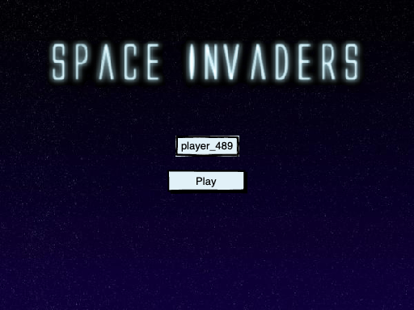
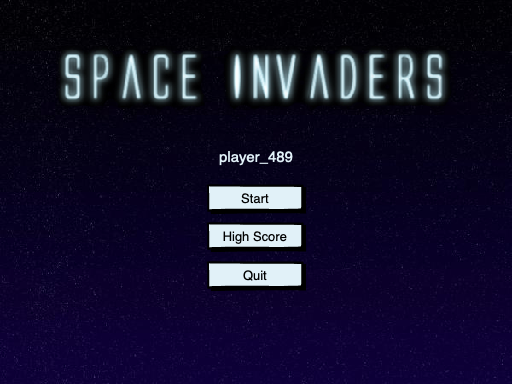
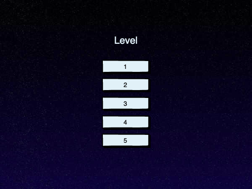
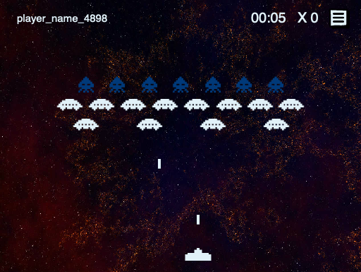
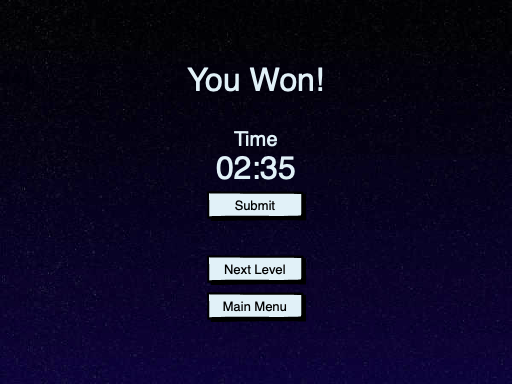
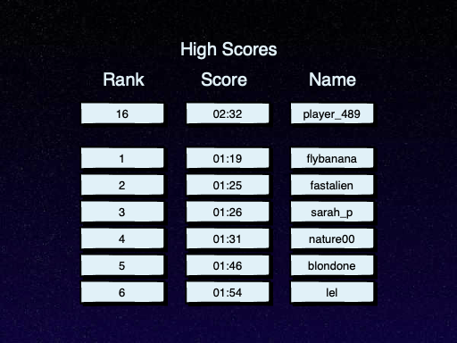

# Space Invaders 👾

The developed project consists on the creation of the classic Space Invaders game. 

Space Invaders was developed in **Java** and integrates **JavaFX** for the interface. 

## Mockups 

## Requirements
- Start and pause a game
- Select Level and support different types of Invaders
- Steering the space ship with the keyboard
- Shoot at Invaders and destroy them
- Share high scores for each level
- Usability
- Conformance to guidelines
- Target platform Java
- Playable offline
